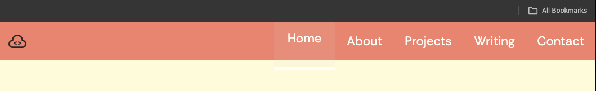

# T1A2 Portfolio Assessment

Deployed website: https://main--t1a2portfolioassignment.netlify.app/
Github Repositiory: t1a2_portfolio: https://github.com/hsc996/t1a2_portfolio

## Sitemap

Below is a written version of the sitemap I devised for the website prior to commencing.
The main pages are listed with '+' signs, and will each be connected by a navigation bar in the header of every page.
The subheadings listed with the '>' icon symbolise links/buttons that will navigate to another page.

+ Home (in pink)
    > Icon links: (navy)
        1. Twitter
        2. Github
        3. LinkedIn
        4. Instgram
+ About
    > Button link to CV
+ Projects
    > Project 1
    > Project 2
    > Project 3
    > Project 4
    > Project 5
    > Project 6
+ Writing
    > Blog #1
    > Blog #2
    > Blog #3
    > Blog #4
    > Blog #5
+ Contact
     > Icon links: (navy)
        1. Twitter
        2. Github
        3. LinkedIn
        4. Instgram

Please see the Sitemap above for the visual representation of how to navigate the website. I've colour coded the sitmap for clarity. The home page is pink -- this is the epicenter as it is the first/main page with the navbar on it. The navbar is in orange -- it leads to the other 5 main categories, which are highlighted in light blue. The contact icons are navy blue, and can be seen on the main page and contact page. The projects are in green and the blog posts in burgundy. The CV page is in purple, and can only be accessed via the "Experience" page.

## Website description

The purpose of this website is to provide prospective employers and professional connections with insight into my experience, who I am and who I aspire to be. This website will prove as a professional platform to showcase my interests, passions, skills, experience, aspirations and values. I've opted for a mobile-first approach to my development to ensure optimization of mobile view of the website, increase user engagement and enhance SEO performance. From this, I have then utilised the @media rule to adapt the layout of the components -- I will be providing screenshots of both views in the descriptions below.

## Home Page

The screenshot above displays the mobile view of the home page. I've used a custom colour palette consisting of 5 colours throughout every page to promote a common theme throughout the website. You'll see this stored in the root:{} selector at the top of each CSS stylesheet so it can be reference easily throughout the code. For the same reason, the header and footer span across the top and bottom of every page, in the same colour.

Within the footer, one is able to see my name with a copyright symbol and the year. This will inform the target audience that the content within the website is my intellectual property, as well as making the website look more professional. At the top left corner, i've added a custom logo to the header in order to promote a professional outlook.

The main title is simply my name, which I've capitalised + increased the font size. I've also created a faded/obscured font shadow using the veridigris colour from the selected colour palette. Given it's the only element on this page with a blue hue, I believe it draws the users attention to this text compotent on first look and gives the page a more bold appearance overall.

The other main graphical component of this page is the main image: a self portrait. In order to give my target audience a sense of who I am, I personally believe it's important to provide some visual reference. Furthermore, I've utlised the box-radius property to round off the corners of the image, which I beileve makes this element more aesthetically pleasing. Lastly, I've resized the image to an appropriate size and employed flexbox styling to center it + make it responsive to multiple screen sizes.

Below the image, I've included a simple professional summary: despite my target audience being individuals within the tech industry, I've also eluded to my nursing career and copywriting work. I feel as though this is important, as it provides prospective employers with the knowledge that, despite my graduate status as a developer, I have extensive experience, multiple skillsets and many transferrable skills.

In the top right hand corner, I've created a responsive hamburger toggle bar, which will present dropdown menu that will allow the user to navigate to each of the main 5 pages: Home, About, Experince, Projects + Contact.

The hamburger toggle display is only visible in the mobile view and will be in the corner of every page to ensure every page is linked ot one another. When clicked, I've animated the hamburge icon animates to transform into a close icon within the dropdown menu, indicating to the user that this icon can be clicked again to close the dropdown menu. The menu appears from the left hand side - I've reduced the opacity in order to make the menu mildy transparent to reduce obstruction to the background features. I've also created a subtle box-shadow to cast from the left hand of the box: providing a 3D allusion to this component.

While it was my intention to make the home page relatively simple, I've included these animations and styling properties to engage user experience and galvanise the overall aesthetic appearance.

Lastly, I've included a 4 more graphic components in a row. I've utilised widely identifiable icons so that the user will understand that these are links to my various professional and social platforms. As seen in the screenshot above, when hovered over in desktop view, I've added padding and box-shadow properties to give a 3D allusion to the icons. I've done this to engage the user and clarify that these are buttons that will direct the user to my various accounts.

The screenshots above, I've provided split images of the desktop view of the home page. As you can see, I've used flexbox styling for all text and graphical components of the page to ensure responsiveness to all screen sizes. Futhermore, you can see that, as the page expands to full screen, the toggle bar transforms into a text menu embedded into the header.

In this screenshot, you can see I've added padding and box-shadow to animate the titles when hovered-over with the cursor. This provides the impression that the titles are "jumping out" of the page. I've employed these properties to engage the user and provide clarity regarding the function of these link buttons.

## About Me

