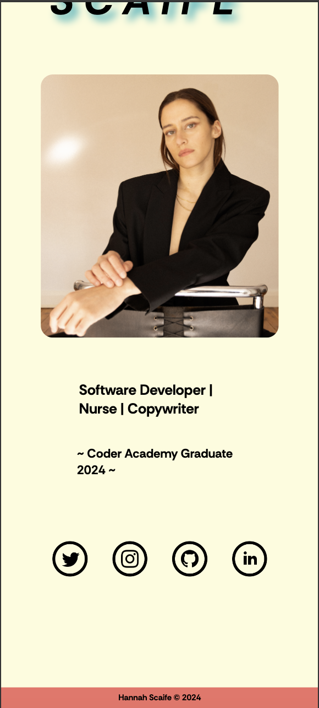
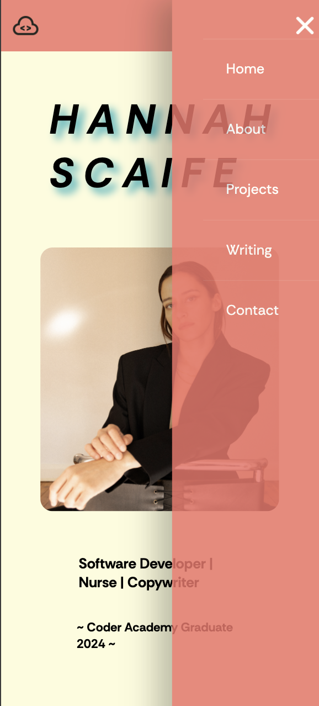

# T1A2 Portfolio Assessment

Deployed website: https://main--t1a2portfolioassignment.netlify.app/
Github Repositiory: t1a2_portfolio: https://github.com/hsc996/t1a2_portfolio

## Sitemap

Below is a written version of the sitemap I devised for the website prior to commencing.
The main pages are listed with '+' signs, and will each be connected by a navigation bar in the header of every page.
The subheadings listed with the '>' icon symbolise links/buttons that will navigate to another page.

+ Home (in pink)
    > Icon links: (navy)
        1. Twitter
        2. Github
        3. LinkedIn
        4. Instgram
+ About
    > Button link to CV
+ Projects
    > Project 1
    > Project 2
    > Project 3
    > Project 4
    > Project 5
    > Project 6
+ Writing
    > Blog #1
    > Blog #2
    > Blog #3
    > Blog #4
    > Blog #5
+ Contact
     > Icon links: (navy)
        1. Twitter
        2. Github
        3. LinkedIn
        4. Instgram

Please see the Sitemap above for the visual representation of how to navigate the website. I've colour coded the sitmap for clarity. The home page is pink -- this is the epicenter as it is the first/main page with the navbar on it. The navbar is in orange -- it leads to the other 5 main categories, which are highlighted in light blue. The contact icons are navy blue, and can be seen on the main page and contact page. The projects are in green and the blog posts in burgundy. The CV page is in purple, and can only be accessed via the "Experience" page.

## Website description

The purpose of this website is to provide prospective employers and professional connections with insight into my experience, who I am and who I aspire to be. This website will prove as a professional platform to showcase my interests, passions, skills, experience, aspirations and values. I've opted for a mobile-first approach to my development to ensure optimization of mobile view of the website, increase user engagement and enhance SEO performance. From this, I have then utilised the @media rule to adapt the layout of the components -- I will be providing screenshots of both views int he descriptions below.

## Home Page

The screenshot above displays the mobile view of the home page. I've used a custom colour palette consisting of 5 colours throughout every page to promote a common theme throughout the website. You'll see this stored in the root:{} selector at the top of each CSS stylesheet so it can be reference easily throughout the code. For the same reason, the header and footer span across the top and bottom of every page, in the same colour. Within the footer, one is able to see my name with a copyright symbol and the year. This will inform the target audience that the content within the website is my intellectual property, as well as making the website look more professional. At the top left corner, i've added a custom logo to the header in order to promote a professional outlook.

In the top right hand corner, I've created a responsive hamburger toggle bar, which will present dropdown menu that will allow the user to na