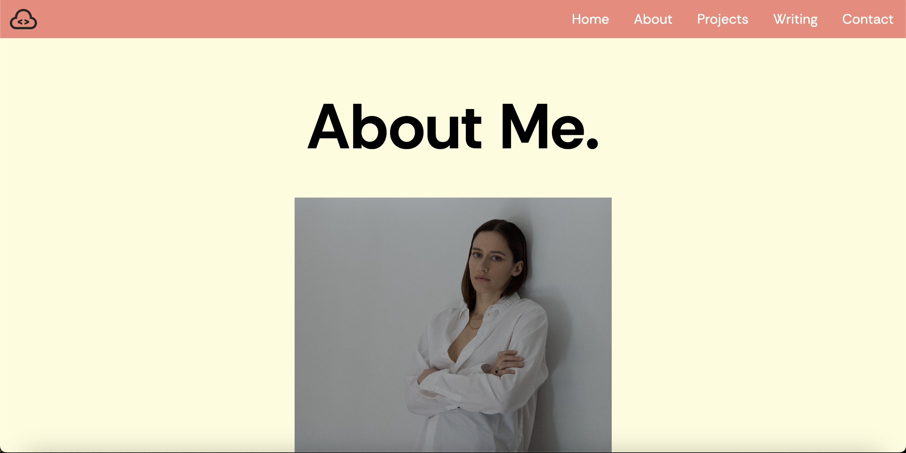
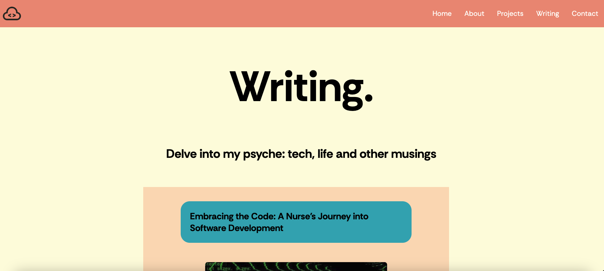
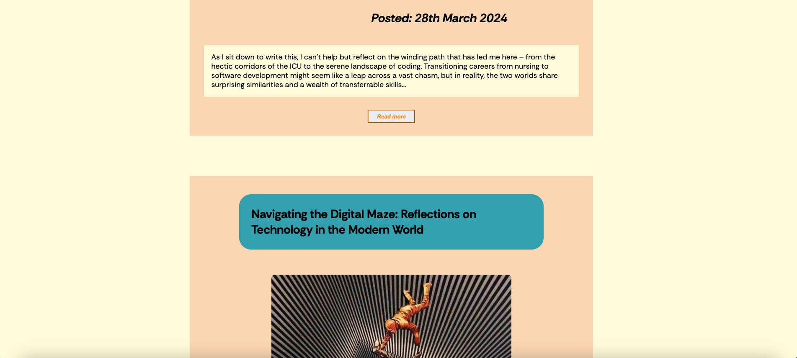

# T1A2 Portfolio Assessment

Deployed website: https://main--t1a2portfolioassignment.netlify.app/
Github Repositiory: t1a2_portfolio: https://github.com/hsc996/t1a2_portfolio

## Sitemap

Below is a written version of the sitemap I devised for the website prior to commencing.
The main pages are listed with '+' signs, and will each be connected by a navigation bar in the header of every page.
The subheadings listed with the '>' icon symbolise links/buttons that will navigate to another page.

+ Home (in pink)
    > Icon links: (navy)
        1. Twitter
        2. Github
        3. LinkedIn
        4. Instgram
+ About
    > Button link to CV
+ Projects
    > Project 1
    > Project 2
    > Project 3
    > Project 4
    > Project 5
    > Project 6
+ Writing
    > Blog #1
    > Blog #2
    > Blog #3
    > Blog #4
    > Blog #5
+ Contact
     > Icon links: (navy)
        1. Twitter
        2. Github
        3. LinkedIn
        4. Instgram

Please see the Sitemap above for the visual representation of how to navigate the website. I've colour coded the sitmap for clarity. The home page is pink -- this is the epicenter as it is the first/main page with the navbar on it. The navbar is in orange -- it leads to the other 5 main categories, which are highlighted in light blue. The contact icons are navy blue, and can be seen on the main page and contact page. The projects are in green and the blog posts in burgundy. The CV page is in purple, and can only be accessed via the "Experience" page.

## Wireframes

## Website description

The purpose of this website is to provide prospective employers and professional connections with insight into my experience, who I am and who I aspire to be. This website will prove as a professional platform to showcase my interests, passions, skills, experience, aspirations and values. I've opted for a mobile-first approach to my development to ensure optimization of mobile view of the website, increase user engagement and enhance SEO performance. From this, I have then utilised the @media rule to adapt the layout of the components -- I will be providing screenshots of both views in the descriptions below.

## Home Page

The screenshot above displays the mobile view of the home page. I've used a custom colour palette consisting of 5 colours throughout every page to promote a common theme throughout the website. You'll see this stored in the root:{} selector at the top of each CSS stylesheet so it can be reference easily throughout the code. For the same reason, the header and footer span across the top and bottom of every page, in the same colour.

Within the footer, one is able to see my name with a copyright symbol and the year. This will inform the target audience that the content within the website is my intellectual property, as well as making the website look more professional. At the top left corner, i've added a custom logo to the header in order to promote a professional outlook.

The main title is simply my name, which I've capitalised + increased the font size. I've also created a faded/obscured font shadow using the veridigris colour from the selected colour palette. Given it's the only element on this page with a blue hue, I believe it draws the users attention to this text compotent on first look and gives the page a more bold appearance overall.

The other main graphical component of this page is the main image: a self portrait. In order to give my target audience a sense of who I am, I personally believe it's important to provide some visual reference. Furthermore, I've utlised the box-radius property to round off the corners of the image, which I beileve makes this element more aesthetically pleasing. Lastly, I've resized the image to an appropriate size and employed flexbox styling to center it + make it responsive to multiple screen sizes.

Below the image, I've included a simple professional summary: despite my target audience being individuals within the tech industry, I've also eluded to my nursing career and copywriting work. I feel as though this is important, as it provides prospective employers with the knowledge that, despite my graduate status as a developer, I have extensive experience, multiple skillsets and many transferrable skills.

In the top right hand corner, I've created a responsive hamburger toggle bar, which will present dropdown menu that will allow the user to navigate to each of the main 5 pages: Home, About, Experince, Projects + Contact.

The hamburger toggle display is only visible in the mobile view and will be in the corner of every page to ensure every page is linked ot one another. When clicked, I've animated the hamburge icon animates to transform into a close icon within the dropdown menu, indicating to the user that this icon can be clicked again to close the dropdown menu. The menu appears from the left hand side - I've reduced the opacity in order to make the menu mildy transparent to reduce obstruction to the background features. I've also created a subtle box-shadow to cast from the left hand of the box: providing a 3D allusion to this component.

While it was my intention to make the home page relatively simple, I've included these animations and styling properties to engage user experience and galvanise the overall aesthetic appearance.

Lastly, I've included a 4 more graphic components in a row. I've utilised widely identifiable icons so that the user will understand that these are links to my various professional and social platforms. As seen in the screenshot above, when hovered over in desktop view, I've added padding and box-shadow properties to give a 3D allusion to the icons. I've done this to engage the user and clarify that these are buttons that will direct the user to my various accounts.

The screenshots above, I've provided split images of the desktop view of the home page. As you can see, I've used flexbox styling for all text and graphical components of the page to ensure responsiveness to all screen sizes. Futhermore, you can see that, as the page expands to full screen, the toggle bar transforms into a text menu embedded into the header.

In this screenshot, you can see I've added padding and box-shadow to animate the titles when hovered-over with the cursor. This provides the impression that the titles are "jumping out" of the page. I've employed these properties to engage the user and provide clarity regarding the function of these link buttons.

## About Me & CV Page

Above are the screenshots of the "About Me" page.I've opted for a simple aesthetic, so as not to distract from the content of this page. As one can see, the website logo and nav bar are consistent to the header atop every page -- with consistent functionality. I've added another graphical component: a self-portrait typical of an "about" section. Bedsides resizing + positioning using flexbox, I've intentionally done little to alter the original appearance of this image: due to a personal preference of aesthetics. Below, I've addressed the purpose of this website by providing a summary of who I am, my skills and professional outlook as a software developer. Not all of the details are factually accurate but have been included for the purpose of this assignment.

At the bottom of the page, one can see I've added padding and rounded the border of the word "experience". This is to elucidate to the user that this section contains button functionality, as it is a hyperlink to the page contianing my CV. I've provided further clarity of this by providing a box-shadow when hovered-over with the cursor in desktop view.

I'm employed semantic elements throughout the html code in order to easily section off all text and graphical elements: when viewing the website, one can see this even-spacing: I've encapsulated the main title with a < h1 > tag, each paragraph with < p > tags and the image with an < article > tag to separate them and make each component easy to position independently. Furthermore, these semantic elements will provide context and clarity to anyone viewing the source code.

The CV page contains nothing more than an image of my mock CV. Ideally, I would have transferred the content of the CV image onto the page as it would allow me to increase the text size to enhance visibiliy of the content. Unfortunately, I was unable to do this as the image was exported using Canva in image form.

The screenshots above, I've provided split images of the desktop view of the about page. One can see I've used flexbox styling to make the text and graphical components reponsive to fit different screen sizes. As explained previously, the header menu has also transformed into the desktop view.

## Projects Page

The sole purpose of this page is to showcase my projects to future employers/potential clients, in order to provide insight into my skills and capabilities. Given my lack of experience in this area, I've used placeholder text and examples of potential projects.

The screenshots above display a mobile view. When referring to the html code, you'll see I've used a flexbox container to apply responsive positioning to all components within. I've used the flex-wrap property to wrap the boxes into rows when the screen is expanded.

Each project preview box has been styled with "verdigris" padding, the same colour used for the font shadow on the home page: promoting a common theme between pages. I've employed the border-radius property to round off the edges of the box, and added a box shadow to provide the a 3D allusion.

The project preview boxes have minimal information, merely an image and title, but when clicked on, I've  created a modal pop-up box displaying a paragraph of Lorem placeholder text: this is where the project description would go. The modal box is designed to deactivate all background elements and redirect the user's focus to the modal content.

These screenshots display this page in desktop view: one can see the display change as the content boxes wrap into a row and remain centered. When added to, this will create a clean grid system of project previews for the user to select from.

Furthermore, I've animated the border to expand laterally when hovered-over with the cursor in desktop view. This will intentionally direct the user's attention to these box components, subsequently highlighting their significance. This can be seen in the screenshot above.

The only other difference in this view is the navigation bar which has been previously explained.

## Writing Page

The purpose of the "writing" page is to showcase 5 blog post previews. The blog post themselves are on separater pages and can be accessed via the button at the bottom of each preview box. These blog posts are designed to provide the audience with an idea into my personal interests, passions and insights. 

In mobile view, I've decided to position the title on the right using the "align-items: flex-end".

Each context box contains a title, image, date published and text box containing the first paragraph of the blog post. Each box employs the same colour-coding for each of these elements to promote a consistent theme. Each content box includes a "read me" button, linking to the corresponding blog page, each containing the full article and 2 graphical components.

The screenshot above displays the way in which the button transforms when hovered-over: I've capitilized the text and changed the font colour. This is designed to redirect the user's attention + elucidate the functionality of this button.

## Contact Page

